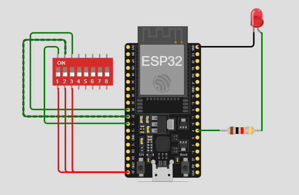

# Practica del dispositivo del edge para PI 1.

## Trabajo Practico Nº 3

### Ejercicio 10: Control de velocidad de parpadeo con dip switch

Utiliza los dip switches sw1.1 a sw1.3 para controlar la velocidad de parpadeo de led1, asignando distintas velocidades.

