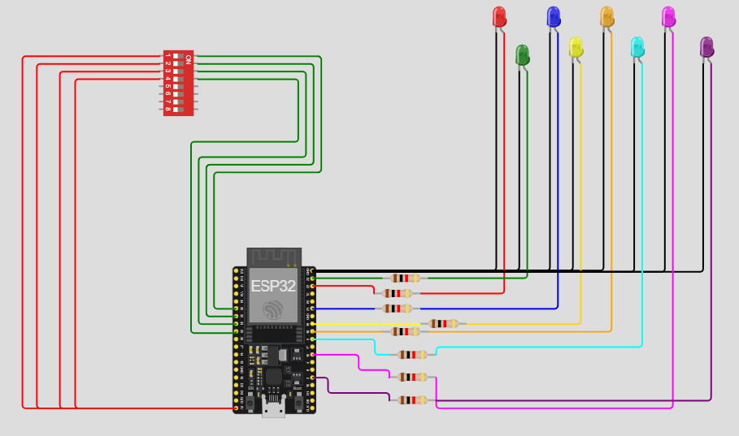

# Practica del dispositivo del edge para PI 1.

## Trabajo Practico Nº 3

### Ejercicio 11: Patrón de parpadeo de LEDs con dip switches

Establece un patrón de parpadeo para los led1 a led8 basado en la combinación de estados de sw1.1 a sw1.4. Por ejemplo, cada posición activa del switch puede representar un patrón diferente (como parpadeo rápido, lento, secuencial, etc.)

