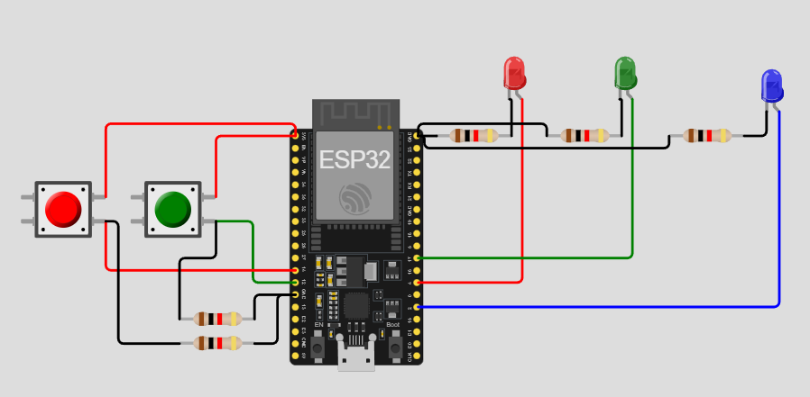

# Practica del dispositivo del edge para PI 1.

## Trabajo Practico Nº 3

## Ejercicio 12: Medidor de pulsaciones

Programa un contador de pulsaciones utilizando btn1. El número de pulsaciones debe mostrarse en una secuencia de LEDs (por ejemplo, led5 a led8 donde cada LED representa una cantidad de pulsaciones).

