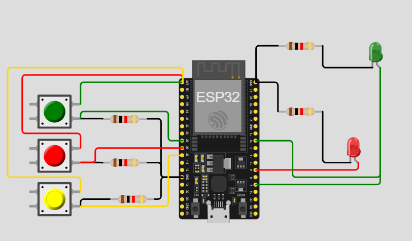

# Practica del dispositivo del edge para PI 1.

## Trabajo Practico Nº 3

### Ejercicio 13: Contraseña con botones

Implementa un sistema de contraseña usando btn1, btn2 y btn3 donde una secuencia específica de pulsaciones activa led1. Si la secuencia es incorrecta, led2 debería encenderse.

