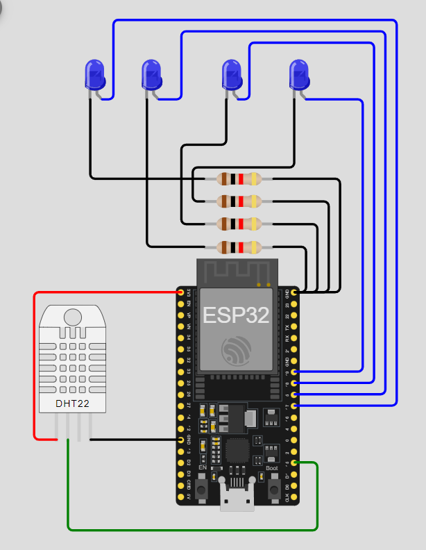

# Practica del dispositivo del edge para PI 1.

## Trabajo Practico Nº 3

## Ejercicio 14: Aplicación de timers para control de LEDs

Utiliza el temporizador del ESP32 para controlar el parpadeo de led1 a led4 sin usar la función delay(), permitiendo que el programa ejecute otras tareas mientras los LEDs parpadean.

