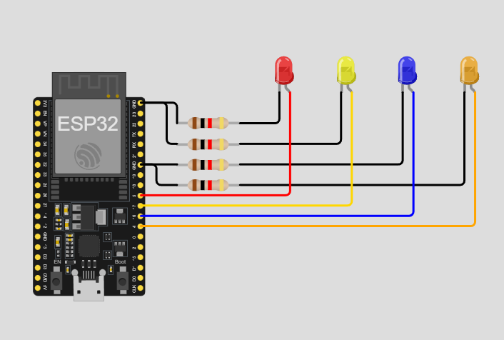

# Practica del dispositivo del edge para PI 1.

## Trabajo Practico Nº 3

### Ejercicio 15: Control de LEDs mediante comunicación serial

Escribe un programa que reciba comandos a través del puerto serie para controlar los LEDs. Por ejemplo, enviar '1' podría encender led1, '2' apagar led2, etc.

