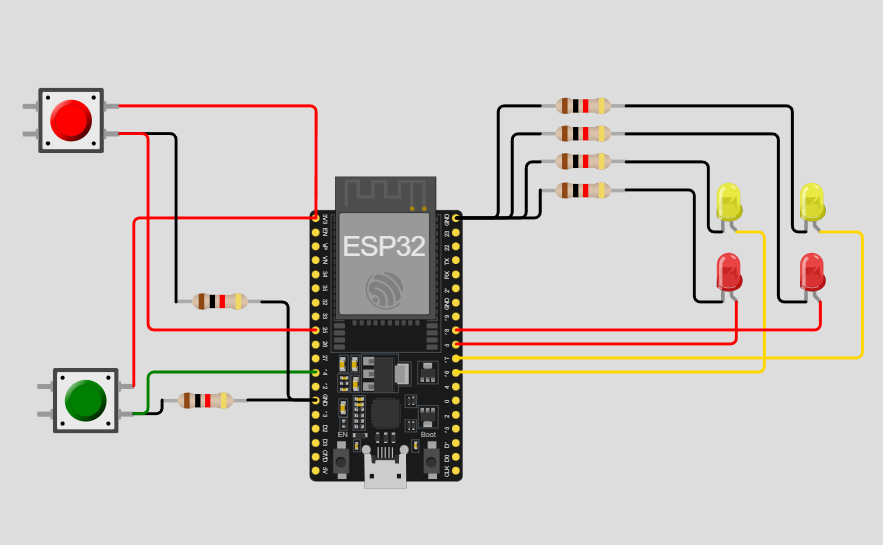

# Practica del dispositivo del edge para PI 1.

## Trabajo Practico Nº 3

### Ejercicio 16: Secuencia de luces de emergencia

Simula luces de emergencia con los LEDs, donde led1 y led2 parpadean alternativamente en un patrón rápido, mientras que led3 y led4 lo hacenen un patrón más lento.

