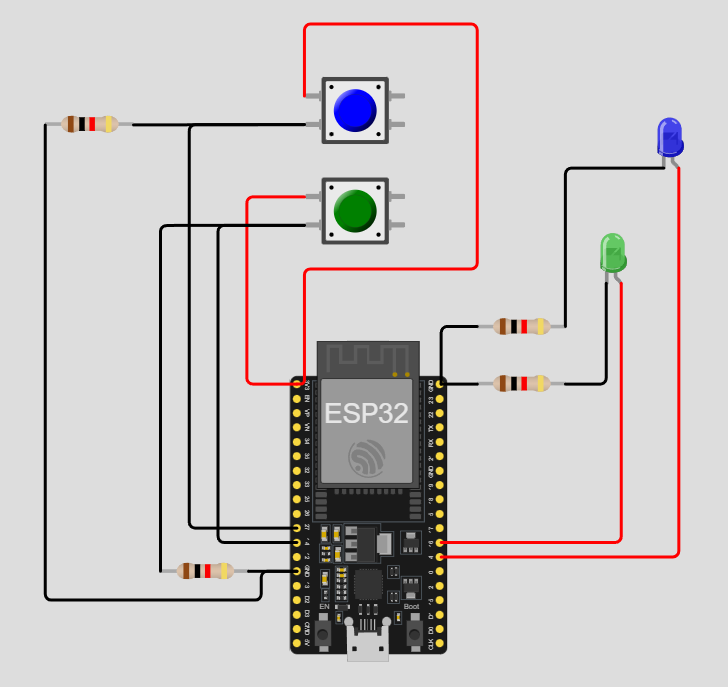

# Practica del dispositivo del edge para PI 1.

## Trabajo Practico Nº 3

### Ejercicio 7: Control de múltiples LEDs con botones

Usa btn1 y btn2 para controlar el estado de led1 y led2 respectivamente.

