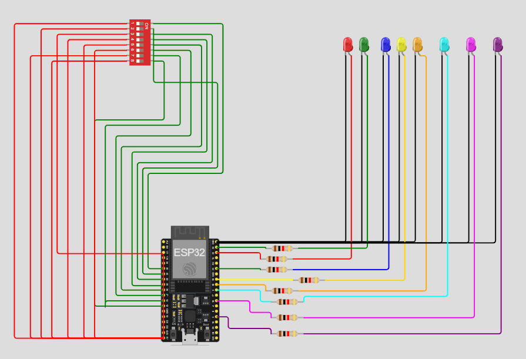

# Practica del dispositivo del edge para PI 1.

## Trabajo Practico Nº 3

### Ejercicio 8: Uso de dip switches para control de LEDs

Lee el estado de los dip switches sw1.1 a sw1.8 y refleja el estado en los led1 a led8.

