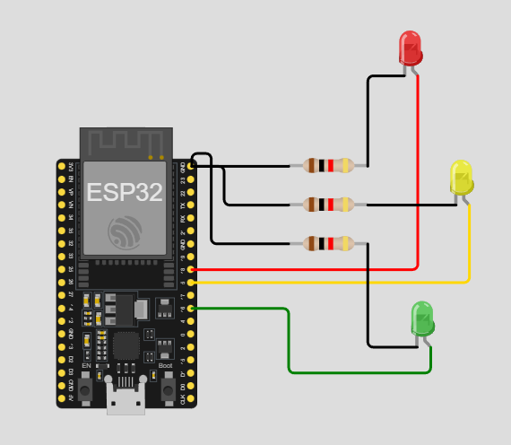

# Practica del dispositivo del edge para PI 1.

## Trabajo Practico Nº 3

### Ejercicio 3: Secuencia de LEDs

Crea una secuencia que encienda los LEDs del led1 al led3 de forma sucesiva, cada uno durante 500ms.

