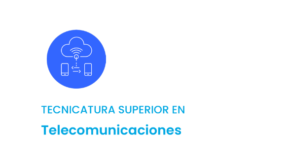

# GUIA RAPIDA DE ARCHIVOS.

**A Requisitos →** Requisitos requeridos para el trabajo práctico Nº3.  
**B Investigación →** Investigación por parte del alumno para el uso del ESP32.  
**C Prototipo →** Practicas en PlatformIO y WOKWI.  
**D Presentación →** Video  
**recursos →** Recurso de imagenes utilizadas.

**Profesor:** Gonzalo Vera.  
**Alumno:** Nicolás Barrionuevo.

